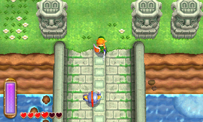
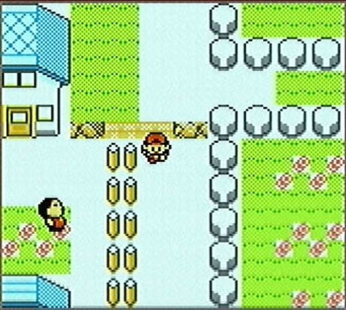

# InheritanceBackground
In this project, we are going to see how to use inheritance to create rich backgrounds such as those used in the earlier Zelda and Pokemon games. Use this document to prepare for the project.






[What is Inheritance?](http://java.sun.com/docs/books/tutorial/java/concepts/inheritance.html) - very basic primer on inheritance in OO languages

[Managing Inheritance](https://docs.oracle.com/javase/tutorial/java/IandI/subclasses.html) - how class hierarchies work
Specifications


## Part One: Install Eclipse, Set up Commit Template, and Import Project

### Install Eclipse

Go to https://www.eclipse.org/ and click the orange Download button. It will take you to another page where you will click the Download button again. This will take you to a third page where you will again click the Download button.

Open up the Eclipse Installer and Click `Eclipse IDE for Java Developers`

Click the Install button.

While it's installing follow the next steps.

### Clone Project and Set up Commit Template

Begin by cloning the provided project and importing it into your workspace.

`git clone <url for github repository>`

After cloning this repository you want to run these commands

`git checkout -b development`

This will create a branch named development and switch you to it. The development branch is where you will make all your commits.

```
cp git-commit-template.txt ~/.git-commit-template.txt
git config --global commit.template ~/.git-commit-template.txt
```

This will set up your commit template to automatically bring up the file to remind you of the format you want.

## Part Two Import Project

In Eclipse, you want to import it as a Gradle project.

Go to File --> Import

Select Gradle, then Existing Gradle Project

Click Next

Click Browse to find your Inheritance_Background and then click Next

Click Override Workspace Settings, and then select Gradle 7.6

Click Next

Once it's finished loading, click Finish

## Part Three: Explore Code

Spend some time(15-20min) just exploring the code. Focus on the Area and OurArea classes. Use these questions to guide your thought process

- How is the grass and stone getting drawn on the screen?

- What code would I need to add to get the fire image drawn on the screen?

- BONUS: How are the trees getting drawn? What code would I need to add to get the tree_2.png image on the screen?

## Part Four:

### Assignment

1. Create a parent class called Tile that you can use to easily build your level. Your code should be set up in a way such that if I wanted to add an additional Tile to your level, you could give me the API for your Tile class and I could create my own custom tile to integrate into your level.

2. You should have 3 custom made tiles in your level.

## Bonus

1. Implement a character that is controlled by the arrow keys. Have your character "react" to the different tiles (e.g. on a water tile, your character "swims" and on land tiles, your character "walks"
